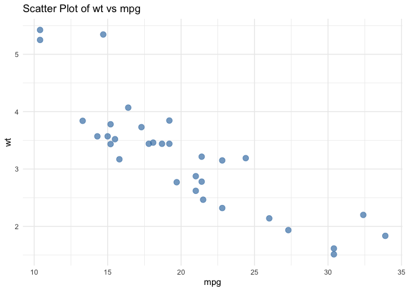

zzysdata Package
================

## zzysdata Package

The **zzysdata** package provides a simple example of creating a custom
R package with data visualization and a Shiny application.  
It includes: - A dataset (`clean_data`) - A custom plotting function
(`plot_scatter()`) - A Shiny app for interactive visualization

### Installation and load

You can install the package (if not already installed) using:

### Overview

The zzysdata package contains example datasets and functions for data
visualization and analysis. It was developed as part of an R package
assignment to demonstrate dataset creation, function documentation, and
plotting.

### Data

The package includes a dataset called clean_data which contains site and
variable information for environmental analysis.

``` r
data("clean_data")
head(clean_data)
```

    ##        Site     Variable Variance
    ## 1 Lewis Run Conductivity       15
    ## 2 Lewis Run  Temperature       10
    ## 3 Lewis Run       Oxygen        3
    ## 4 Lewis Run    Turbidity       12
    ## 5 Lewis Run    Elevation        6
    ## 6   Caribou Conductivity        4

### Visualization

We can also visualize the clean_data dataset using ggplot2.

``` r
ggplot(clean_data, aes(x = Site, y = Variance, fill = Variable)) +
geom_bar(stat = "identity", position = position_dodge()) +
labs(
title = "Relative Importance of Predictors Across Sites",
x = "Stream Site",
y = "Variance Explained (%)"
) +
theme_minimal()
```

<!-- -->

### Project Summary

This project involved developing an R package named zzysdata as part of
the ETC5523 “Communicating with Data” Assignment 4. The package contains
a cleaned dataset, useful data exploration functions, and an interactive
Shiny application. Using devtools and usethis, I structured the package
with directories for raw data, documentation, and the Shiny app. The
function plot_scatter() was created to visualize relationships between
variables and tested successfully using the mtcars dataset. The Shiny
app, located in inst/app/, allows users to interactively explore the
data and visualize trends dynamically. All components, including
documentation generated with roxygen2, were verified through
devtools::document(), build(), and check(). Finally, a pkgdown site was
configured to host the package documentation and vignettes. Overall,
this project demonstrates the complete workflow from data cleaning and
analysis to creating a user-friendly, interactive, and well-documented R
package.

# Website

zzysdata package is published at:
<https://etc5523-2025.github.io/assignment-4-packages-and-shiny-apps-ZHAOYU-ZHANG1/>
